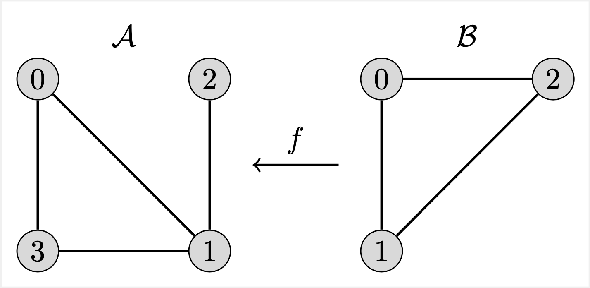

<!-- ABOUT THIS PROJECT -->

# A quantum algorithm for the subgraph isomorphism problem.

<!-- TABLE OF CONTENTS -->
### Table of Contents
* [Tutorials](docs)
* [About This Project](#about-this-project)
* [How to Give Feedback](#how-to-give-feedback)
* [Contribution Guidelines](#contribution-guidelines)
* [Acknowledgements](#acknowledgements)
* [References](#references)
* [License](#license)

---

### About This Project

The present work is a Qiskit-based implementation of a method for solving the sub-graph isomorphism problem on a gate-based quantum computer.
The method relies on a new representation of the adjacency matrices of the underlying graphs and it requires a number of qubits that scales **logarithmically** with the number of vertices of the graphs.
Given two undirected graphs A and B (the former with equal or larger number of vertices than the latter), the sub-graph isomorphism problem is the problem of finding occurrences of graph B into graph A.
If the two graphs have the same number of vertices, then the problem is known as graph isomorphism, which is therefore a special case.
More details can be found in the following paper [[1]](#references).
The sub-graph isomorphism problem has numerous applications when data can be represented as networks, and notably in graph databases, biochemistry, computer vision, social network analysis, knowledge graph query, among many others.

<figure>

<figcaption align = "center">Fig. 1 - The concept of subgraph isomorphism.</figcaption>
</figure>

The main demo, which also manages the requirements, is located [here](docs/subgraph-isomorphism-demo.ipynb). A brief 
overview of the problem, proposed solution and some results can be found in the [poster](docs/poster.pdf) presented
at the European Quantum Technology Conference, Nov 29th - Dec 2nd, 2021, Dublin, Ireland.

---

<!-- HOW TO GIVE FEEDBACK -->
### How to Give Feedback
We encourage your feedback! You can share your thoughts with us by:
- [Opening an issue](https://github.com/qiskit-community/subgraph-isomorphism/issues) in the repository
- [Starting a conversation on GitHub Discussions](https://github.com/qiskit-community/subgraph-isomorphism/discussions)

---

<!-- CONTRIBUTION GUIDELINES -->
### Contribution Guidelines
For information on how to contribute to this project, please take a look at [CONTRIBUTING.MD](CONTRIBUTING.md).

---

<!-- ACKNOWLEDGEMENTS -->
### Acknowledgements
This module is based on the theory and experiment described in [[1]](#references).

The code on which this module is based was written by Nicola Mariella.

We are highly thankful to Dr. Andrea Simonetto, 
Dr. Claudio Gambella (both were at IBM Research Europe - Dublin), 
Dr. Martin Mevissen (IBM Research Europe - Dublin)
and Prof. Jiri Vala (Maynooth University - Dep. of Theoretical Physics) for their precious suggestions.

---

<!-- REFERENCES -->
### References
[1] Nicola Mariella, Andrea Simonetto, *A Quantum Algorithm for the Sub-Graph Isomorphism Problem*, https://arxiv.org/abs/2111.09732

<!-- LICENSE -->
### License
[Apache License 2.0](LICENSE.txt)